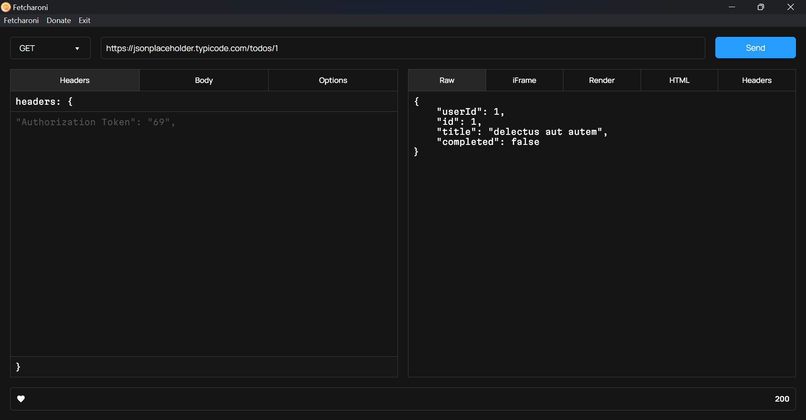

<strong>Fetcharoni</strong>

`Simple and fast API testing`

---

Fetcharoni uses the Node.js fetch API.

Feel free to contribute. PRs on implementing esbuild for this project or making the output file size smaller would be very much appreciated.

It is recommended to download the single .exe file. The name for the file should be `fetcharoni.exe`

---

[Support me on Patreon](https://www.patreon.com/axorax) —
[Check out my socials](https://github.com/axorax/socials)
